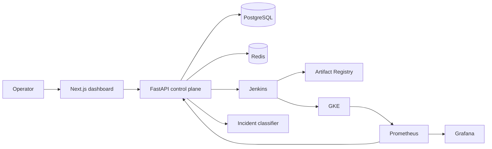

# Architecture

DeployPilot separates its public control plane from privileged execution.

The control plane owns metadata, policy, audit history, and the operator experience. Jenkins owns build execution. Kubernetes owns desired runtime state. Prometheus is the source for post-release health decisions.

## Release state machine

`queued → building → deploying → verifying → healthy`

Any execution failure moves a release to `failed`. A failed health gate invokes `kubectl rollout undo`; a successful undo moves it to `rolled_back` and opens an incident.

## Trust boundaries

- Browsers receive product data, never kubeconfigs or Jenkins tokens.
- The API validates authenticated identity and role before mutations.
- Jenkins uses Workload Identity and short-lived credentials.
- Kubernetes resources default to non-root, least privilege, and deny-all ingress.
